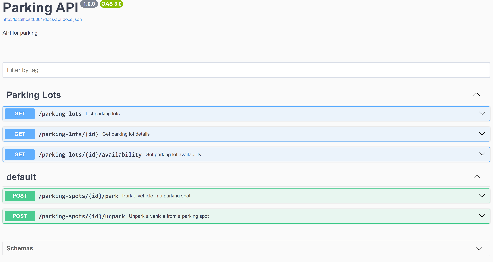
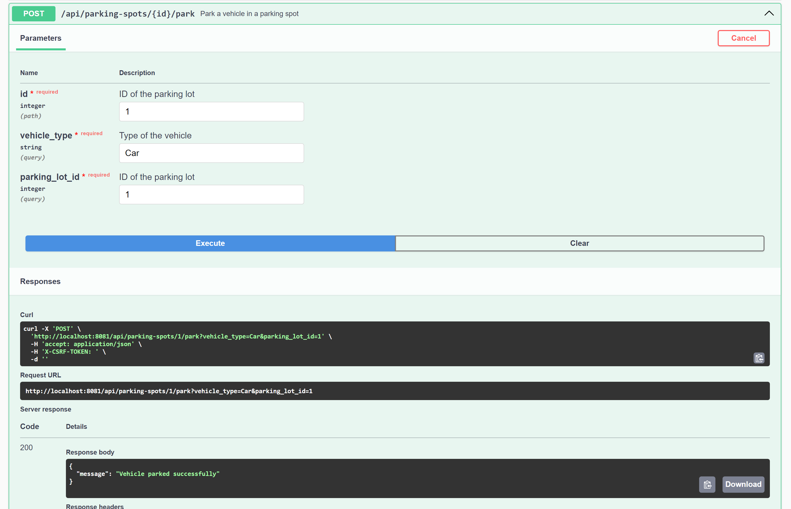
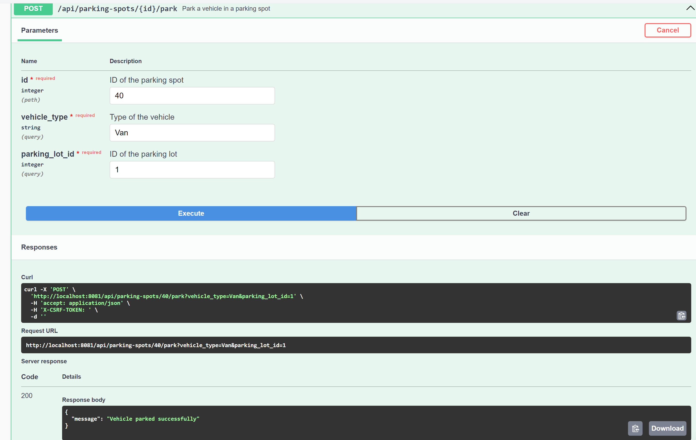
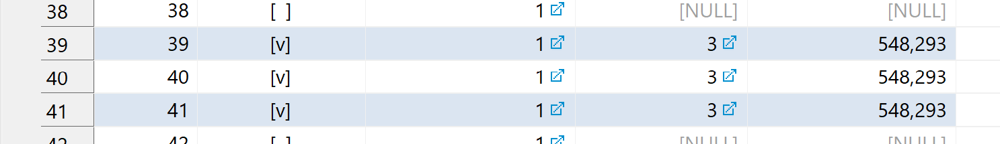
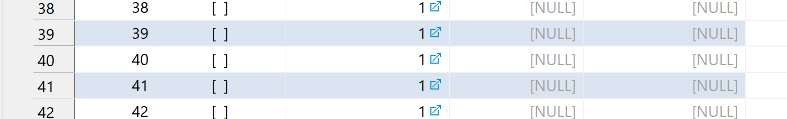

# Technical Interview Challenge 1

## Installation

1. Install docker compose https://docs.docker.com/compose/install/#scenario-one-install-docker-desktop
2. Clone the repository
2. Run `make up`
4. Run `make composer`
3. Run `make migrate`
4. Load in browser http://localhost:8081

## API Manual Testing

Swagger documentation is available here: http://localhost:8081/api/documentation

### Parking lot tests:

### Car park test:

